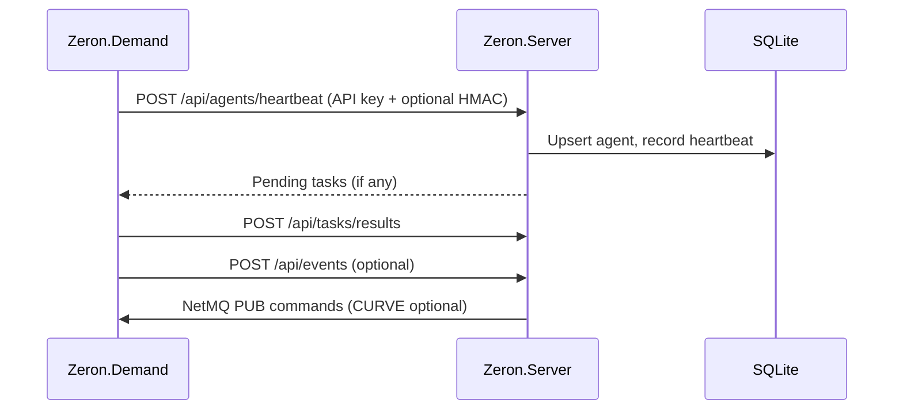

# Agent Connection Guide

This document explains how agents connect to **Zeron.Server**, how connection health is determined, and how to troubleshoot common issues.

## Connection Flow



1. **Heartbeat** — Agent sends status every ~30s with `AgentId`, machine name, uptime, and queue stats.
2. **Task pull** — Pending assignments are returned in the heartbeat response.
3. **Result report** — Agent posts task execution results to `/api/tasks/results`.
4. **Command push** — Server may push commands via NetMQ PUB (`CommandPubAddr`), optionally protected with CURVE.

## Connection States

The Dashboard **Agents** page and diagnostic API report these states:

| State | Meaning |
|-------|---------|
| `healthy` | Heartbeat received within half of the timeout window |
| `stale` | Heartbeat aging; may go offline soon |
| `offline` | No heartbeat within `HeartbeatTimeoutSeconds` (default 90s) |
| `never_seen` | Agent record exists but no heartbeat ever received |
| `disabled` | Administrator disabled the agent |

### Diagnostic API

Authenticated endpoints (Viewer role or above):

```
GET /api/agents/diagnostics
GET /api/agents/{agentKey}/diagnostics
```

Response fields include `connectionState`, `diagnosticMessage`, `recommendedAction`, and `hasOpenOfflineAlert`.

## Troubleshooting

### Agent not appearing

1. Confirm `server_enabled=true` in agent `App.config`.
2. Verify `server_url` points to the correct host and port.
3. Check `server_api_key` matches server `Zeron:AgentApiKey`.
4. Review agent logs (`NLog`) for HTTP errors.

### Agent shows offline or stale

1. Ensure **Zeron.Demand** Windows Service is running.
2. Test connectivity: `curl http://server:5000/api` from the agent machine.
3. Check firewall rules for HTTP (5000) and NetMQ (6000).
4. Increase `HeartbeatTimeoutSeconds` only if network latency requires it.

### Heartbeat returns 401 Unauthorized

The `X-Zeron-Agent-Key` header is missing or does not match `Zeron:AgentApiKey`. If `AgentHmacRequired=true`, also ensure `server_hmac_enabled=true` and clocks are within `AgentHmacSkewSeconds`.

### Commands never arrive (SUB / CURVE)

1. Confirm `zmq_sub_enabled=true` and `zmq_sub_addr` points at the Server PUB address.
2. If Server has `CurveEnabled=true`, agent must set `zmq_sub_curve_enabled=true` and a valid `zmq_sub_curve_server_public_key_file`.
3. Both sides must agree: CURVE on or CURVE off — mixed mode will not connect.

### Open offline alert

When an agent goes offline, `AlertRuleServer` creates an `agent.offline` alert. It auto-resolves when the agent heartbeats again. View alerts on the Dashboard **Alerts** page.

## Agent Configuration Example

```xml
<appSettings>
  <add key="server_enabled" value="true" />
  <add key="server_url" value="http://192.168.1.100:5000" />
  <add key="server_api_key" value="your-shared-secret" />
  <add key="server_hmac_enabled" value="true" />
  <add key="zmq_sub_enabled" value="true" />
  <add key="zmq_sub_addr" value="tcp://192.168.1.100:6000" />
  <add key="zmq_sub_api_key" value="your-shared-secret" />
  <add key="zmq_sub_curve_enabled" value="true" />
  <add key="zmq_sub_curve_server_public_key_file" value="Resource/curve-server.public" />
</appSettings>
```

After changing configuration, restart the Zeron.Demand service.
